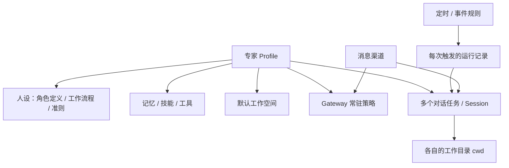

# 专家模块增量需求整理

日期：2026-09-21  
状态：需求讨论稿，新增规则均为建议，尚未作为实现承诺。  
范围：按本轮提出的条目整理专家模块增量；不修改现有原型和原始 PRD。

参考：`expert-profile-mvp-prd.md`、`task-session-mvp-prd.md`、`project-kanban-mvp-prd.md`，以及 2026-09-18 的上一版讨论稿。Hermes 映射来自已有 PRD，未通过 Hermes 后端源码验证；前端存在某项功能不代表后端能力已完成。

本轮相对上一版的变化：

- 新增：人设拆分为「角色定义 / 工作流程 / 准则」。
- 新增：开启了消息渠道的专家的启动策略。
- 本轮不展开 WorkerFlow / 多专家协作流程。
- 其余条目在上一版基础上按当前原型与 PRD 对齐，压缩为可评审规则。

## 一、本轮条目与现状

| 条目 | 现状 | 本轮要解决的问题 |
|---|---|---|
| 人设三分栏 | 人设 Tab 仍是单份 `SOUL.md` 编辑器；模板里已有「核心职责 / 工作流程 / 行为准则」标题；store 曾有三段字段，但编辑器已合并为 `soulMd` | 把人设从「一篇长文」改成三个可独立编辑的产品区块 |
| 渠道专家启动策略 | 产品层不设计专家启停开关，只观察「有无运行中 session」；启用渠道后前端已提示「专家将保持启动」；gateway 需手动重启才真正连上 IM | 明确：开了渠道的专家何时拉起、如何保活、何时停止，避免网页关掉就收不到消息 |
| 工作空间 / 工作目录 | PRD 已区分工作空间根与 session `cwd`；默认 cwd = 工作空间根 | 把专家、任务、自动化运行的目录关系讲清楚，避免混用 |
| 定时 / 事件任务 | 对话任务已有；定时依赖 Hermes cron；事件任务尚未产品化 | 统一成「自动化规则 + 每次运行记录」，不要和对话 Session 混成一个对象 |
| 记忆开关 | 记忆 Tab 只读展示 `MEMORY.md` / `USER.md`；`memory_enabled` 默认开；cron 默认 `skip_memory` | 增加可读/可写控制，关闭不等于删除 |
| 技能更新开关 | 技能 Tab 有启用开关、安装、删除；没有「专家能否自己改技能」 | 把「能不能用」和「能不能自己改」分开 |
| 消息渠道 @ / 发文件 | IM Tab 可配企微 / 钉钉 / 飞书；群聊需 @ 是策略字段；发送文件与真实 @ 成员未闭环 | 补齐入站触发、路由、出站提醒、文件投递 |
| 对话区优化 | 任务对话页已有流式回复、工具卡片、澄清、附件、工作目录 | 让结论、进度、待回应、产物更容易被找到 |
| 快捷指令 | PRD 规划了 `/new /clear /help /skills /model`；当前输入区主要支持 `@file:`，斜杠命令未落地 | 系统操作与业务模板分开，语义不能含糊 |
| 任务归档 | 对话任务前端有本地 `archived`；看板归档是只读终态且不可恢复 | 对话任务可归档可恢复；不要套用看板规则 |

优先统一对象和状态，再做入口与自动化。否则「任务」会同时表示定时规则、某次执行、对话 Session 和看板卡片。

## 二、统一概念

| 对象 | 定义 | 关键关系 |
|---|---|---|
| 专家 | 一套独立身份和能力配置，沿用 Profile | 拥有人设三段、记忆、技能、工具、渠道及默认工作空间 |
| 工作空间 | 专家默认使用和浏览的文件目录树 | 被该专家的多个 Session 共享浏览 |
| 工作目录 | 某个 Session 的文件操作默认位置，即 cwd | 同一空间下不同 Session 可以不同 |
| 对话任务 | 用户与一位专家持续处理一个事项的对话 | MVP 一个对话任务对应一个 Session |
| 自动化规则 | 什么时间或事件发生时，执行什么工作 | 一条规则可产生多次运行记录 |
| 运行记录 | 某一次执行及其结果 | 每次触发独立；不要复用同一个模型上下文冒充多次运行 |
| Gateway | 专家的消息渠道进程 | 开了渠道的专家需要它常驻，才能收 IM |



状态必须分开表达：

- Session 执行状态：未开始、运行中、待回应、空闲、失败。专家回复结束只代表这一轮结束，不等于业务完成。
- 专家渠道状态：无渠道、待启动、渠道在线、连接异常。这与「有没有运行中任务」不是一回事。
- 自动化规则状态：启用、暂停、配置异常。一次失败不要把规则标成已完成。
- 对话任务归档：列表管理属性，与运行状态分开。

## 三、逐项需求

### 3.1 人设：拆成角色定义、工作流程、准则

**已有约定：** 人设等价于 `<HERMES_HOME>/SOUL.md`，进入系统提示词 stable 层；保存仅新会话生效。现有模板标题是「核心职责 / 工作流程 / 行为准则」，但编辑器仍是单文档。

**本轮建议：** 产品层拆成三个编辑区，底层仍合成一份 `SOUL.md` 交给 Hermes。不要改成三个互不相干的 prompt 文件，以免破坏 prompt 缓存和新会话生效规则。

| 产品区块 | 建议写入什么 | 不写入什么 |
|---|---|---|
| 角色定义 | 身份、职责范围、服务对象、交付物、能力边界 | 逐步操作手册、临时任务细节 |
| 工作流程 | 接到任务后的标准步骤、何时查资料、何时提问、产物如何落盘 | 底线与禁令（放到准则） |
| 准则 | 必须遵守 / 禁止事项、证据要求、升级与澄清规则、风格约束 | 某一次任务的具体指令 |

命名对齐：本轮采用「角色定义 / 工作流程 / 准则」。现有模板中的「核心职责」并入角色定义，「行为准则」并入准则。工作目录与产物约定建议放进工作流程，不单开第四块。

**交互建议：**

1. 人设 Tab 用三个子页或分段编辑器，每段独立 markdown，共用一套工具栏。
2. 保存时按固定标题拼回 `SOUL.md`，例如：

```markdown
## 角色定义
...

## 工作流程
...

## 准则
...
```

3. 导入旧 `soul.md` 时，按标题拆段；无法识别的内容进入「角色定义」，并提示用户检查。导出仍是一份 markdown。
4. 空段不写空标题，避免给模型注入无意义结构。三段全空时继续走 Hermes 默认人格。
5. 保存规则不变：只在新会话生效；有运行中会话时明确告知数量。
6. 预览展示合成后的完整人设，并标明三段来源。

**验收示例：** 只改准则后，新 Session 能读到新准则，旧 Session 仍用旧全文；导入一篇带三个标题的 md 能正确拆段；某一段留空不影响另外两段生效。

**边界：** 三分栏是编辑结构，不是三个独立生效开关。不能出现「只启用准则、不启用角色定义」。

### 3.2 开启了消息渠道的专家：启动策略

**已有约定：** Profile 目录本身没有启用/停用。活动状态目前只观察「有无运行中 session」。IM 配置变更需要重启 gateway。原型在启用渠道时已提示「该专家将保持启动状态」。

问题在于：用户关掉网页后，如果 gateway 也停了，渠道消息无人接收。开了渠道的专家不再是「用的时候再启动」的配置对象，而是一个需要保活的在线服务。

**建议把专家运行分成两种模式：**

| 模式 | 条件 | 行为 |
|---|---|---|
| 按需启动 | 未启用任何消息渠道 | 用户打开对话或自动化触发时再拉起执行；没有任务时不必常驻 gateway |
| 渠道常驻 | 至少启用一个已配置渠道 | 保持该专家的 gateway 运行，持续接收和回复渠道消息；关闭网页不能停掉 |

「保持启动」指 **gateway 常驻**，不是一直占着一个空的对话 Session，也不是把专家卡片强行显示成「任务运行中」。

**启动时机：**

1. 用户启用第一个可用渠道并保存成功后，自动启动（或重启）该专家 gateway。
2. 平台/服务进程启动时，扫描所有「至少有一个已启用且已配置渠道」的专家，自动拉起对应 gateway。
3. gateway 异常退出时自动拉起，带退避，避免崩溃循环；连续失败进入「连接异常」，通知用户，不再无限重启。
4. 用户点击「应用渠道配置 / 重启」时按现有路径重启。

**停止时机：**

1. 用户关闭该专家最后一个渠道后，停止常驻。若此时没有运行中 Session，可停止 gateway。
2. 删除或重命名专家时，先停 gateway，再改目录。
3. 不允许在渠道仍启用时把专家停成「收不到消息」而不给警告。若提供手动停止，必须提示「停止后该渠道将无法接收消息」，并允许一键恢复。

**状态展示建议：**

| 展示 | 含义 | 不要和什么混淆 |
|---|---|---|
| 渠道在线 | gateway 存活，且至少一个渠道 `connected` | 不是「正在做任务」 |
| 待应用 | 配置已改，gateway 尚未重启 | 不是已连接 |
| 连接异常 | 该常驻但仍连不上 | 不是专家被停用 |
| 任务运行中 | 有 session `status=running` | 可以和渠道在线同时存在 |

专家列表 / 详情页需要同时能看到「渠道状态」和「运行中任务数」。启用渠道成功后的文案建议改为：「已为该专家开启渠道常驻。关闭本页面后仍会接收渠道消息。」

**与其他能力的关系：**

- 定时 / 事件任务：未开渠道时按触发按需拉起；开了渠道则复用已常驻的 gateway / runtime，不要再叠一套互相打架的启停。
- 记忆、技能、人设修改：仍是新会话生效，不要求重启 gateway。渠道 token / 启用状态变更才重启 gateway。
- 多专家同时开渠道：每个专家独立 gateway，凭据不可复用（沿用现有互斥校验）。

**验收示例：** 启用企微后关掉网页，群里 @ 机器人仍能进到该专家；平台重启后该专家自动恢复渠道在线；关掉全部渠道后不再自动拉起；gateway 挂掉后能看到连接异常而不是静默消失。

**待确认：** 常驻失败时是否允许用户改为「仅网页在线时接收」；多专家常驻的资源上限。

### 3.3 工作空间 / 工作目录 与 专家 / 任务 Session

**已有约定：** 工作空间根来自 Profile `terminal.cwd`；该专家所有 Session 可浏览整棵树。Session 单独保存 cwd，默认等于工作空间根，不自动创建 `tasks/<session-id>`。配置、技能、记忆、对话历史仍在 Profile 数据目录，不放进工作空间。

**新增建议：**

1. 对话页同时标明「专家工作空间」和「当前任务工作目录」。选中或预览文件夹不会隐式改变 cwd。
2. 创建时目录优先级：用户明确指定 > 项目/流程提供的目录 > 专家默认工作空间。
3. Session 创建后保存实际路径。改专家或项目默认目录只影响之后新建的 Session，不迁移旧文件、不改写旧 Session。
4. 普通对话保留手动选目录。自动化可增加「每次运行独立子目录」，作为显式选项，不改变普通对话默认值。
5. cwd 仅允许在执行空闲时切换。路径失效时给出修复入口。远程部署中的目录属于执行机器，不能把前端本机路径直接当后端路径。
6. 工作目录不是权限沙箱。现有 PRD 未承诺文件系统硬隔离。

**验收示例：** 同一专家两个 Session 使用不同 cwd；切换任务后路径正确恢复；修改专家默认目录后，旧任务仍指向旧路径。

### 3.4 任务：定时任务与事件任务

两者都是自动化规则，差别只在触发条件。每次触发生成运行记录，记录规则版本、输入、专家、Session、实际工作目录和结果。

| 维度 | 定时任务 | 事件任务 |
|---|---|---|
| 触发 | 单次时间、重复周期、时区 | 事件来源、类型、过滤条件 |
| 输入 | 固定指令，可带时间范围等变量 | 指令模板 + 事件字段映射 |
| 场景 | 每天日报、每周巡检 | 告警到达、文件更新、上游完成 |
| 特有规则 | 停机后的漏跑策略 | 去重、去抖、来源校验、防循环 |
| 通用配置 | 启停、工作目录、超时、重试、结果投递 | 同左 |

**第一版规则：**

- 每次触发默认新建 Session。只有明确的持续跟踪场景，才续接已有 Session。
- 同一规则默认不重叠执行；上一轮未结束则本次记为跳过并显示原因。
- 服务恢复后默认跳过已错过的周期，不集中补跑。
- 同一来源的重复事件只建一条逻辑运行记录。重试是该记录下的尝试，不能被重复通知建成新任务。
- 有外部写入或发送动作时，业务动作本身要能幂等；只对触发事件去重不够。
- 需要澄清或审批时进入「待回应」，通知用户；超时后按约定结束，不能默认替用户批准。
- 执行结果和消息投递结果分别记录。文件发送失败只重试投递，不重跑分析。
- 规则暂停只阻止新触发；当前执行提供独立停止。配置变更不影响已经开始的运行。

**与记忆：** 现有 PRD 写明 cron session 默认 `skip_memory=True`。产品层第一版继续这个默认，并在规则上显示「默认不写入长期记忆」；若要积累经验，作为规则级显式开关，同时受专家记忆总开关约束。

**验收示例：** 同一事件送达两次只产生一条运行；定时规则显示时区和下次执行时间；暂停后不再新建运行；失败能定位到具体 Session。

### 3.5 记忆开关与记忆

**已有约定：** 记忆分「专家经验」和「用户画像」；MVP 展示内置文件；写入由模型调用工具触发；专家之间隔离。关闭长期记忆不会删除历史，也不会清空当前对话。

需要区分三种东西：

- 对话历史：该 Session 发生过什么。
- 任务摘要：该事项的结论、未完成工作、交接信息。
- 长期记忆：跨任务复用的经验、偏好、约定。

**建议规则：**

1. 专家级「使用长期记忆」作为总开关。高级设置可再拆「读取已有记忆」和「允许沉淀新记忆」，形成关闭 / 只读 / 读写。
2. 普通任务继承专家设置；任务可以进一步关读取或写入，但不能绕过专家级禁止。
3. 关闭不删除已保存记忆。清空、删除、导出是独立操作。文案写「已暂停使用，记忆仍保留」。
4. 禁止写入必须在运行服务和记忆工具层生效，不能只靠提示词。新建 Session 不再加载被关闭的记忆；已经注入运行中 Session 的内容无法靠开关撤回，需说明完整关闭在新 Session 生效。
5. 自动化和渠道任务同样遵守开关。并发写同一专家记忆时要走统一写入服务，避免互相覆盖。
6. 第一阶段先做开关和只读展示；再补来源任务、更新时间、变更记录。来源无法还原时标未知，不伪造出处。
7. 多用户时，用户画像必须按用户标识区分。现有单份 `USER.md` 不足以自动保证这一点。

**验收示例：** 关闭后新 Session 不自动加载长期记忆，也不能通过记忆工具新增；对话历史可恢复；重新打开后旧记忆仍在。

### 3.6 技能更新开关

「技能更新」至少有三种含义，不能共用一个没说明的开关：

| 控制项 | 含义 | 关闭后 |
|---|---|---|
| 技能启用 | 专家是否可以使用此技能 | 新 Session 不再提供该技能 |
| 专家自主更新技能 | 专家能否根据执行经验修改或新建技能 | 仍能使用已启用技能，只禁止自己改 |
| 外部版本自动升级 | 是否同步 Hub / 源仓库新版本 | 与自主更新分开配置 |

本轮按「允许专家自主更新技能」做。外部升级另设，本轮不承诺。

**建议规则：**

- 首版默认关闭自主更新；用户手动安装、编辑、启停仍可做。
- 用户打开后，记录变更前后内容、原因、关联任务、操作主体，支持回滚。
- 区分用户手动修改与模型自主修改；专家级开关可叠加技能级只读。
- 关闭时，技能管理工具、文件写入、终端等可能改到 `skills/` 的路径都要受运行层约束。只藏一个工具或加一句提示词，不能叫完整禁止。
- 自动化运行不要因为生成了技能补丁就停掉当前业务任务；补丁先成为待应用版本。

**验收示例：** 关闭自主更新时仍能完成已有技能任务，但无法自主改技能；打开后能看到修改记录并回滚。

### 3.7 消息渠道：艾特、发送文件

把「填好凭据」推进为「接收消息 → 路由到专家/任务 → 执行 → 投递结果」。

**@ 拆成三个需求：**

1. 入站触发：群里 @机器人/应用时，是否执行。钉钉/飞书已有「群聊需 @」。
2. 产品路由：用户指定某个专家或任务时，如何定位。普通文本 `@专家名` 是产品语法，不是平台真实提及。
3. 出站提醒：专家发消息时能否真正 @某个成员，或只是文本里出现名字。

专家重名时使用唯一标识或选择器。不同渠道形态（AI Bot、自建应用、群机器人）的能力不能互相假定。

**发送文件：**

- 明确目标会话、来源产物、类型/大小限制、上传与发送进度、失败原因。
- 区分「平台接口已接受」和「成员已读」。没有平台证据时不能显示已读。
- 使用独立投递记录和重试标识，避免重试时重复通知或重新执行任务。

**必要产品规则：**

- 专家绑定应用的方式、允许使用的人与会话范围、渠道身份映射到平台用户的方式。
- 新消息续接哪个 Session：建议按渠道、企业/应用、会话、发送人、专家形成路由键，并允许显式关联任务。群共享上下文必须是明确配置，不能默认为全群共用一个 Session。
- 网页对话和 IM 按任务关联复用记录；IM 给摘要和详情入口，不完整复制工具日志。

**验收示例：** 允许用户的一条渠道消息能定位到专家和 Session；生成产物后能向明确目标发文件；失败可查看原因并只重试投递。

### 3.8 对话区优化

现有任务对话 PRD 已覆盖流式回复、工具卡片、子代理、澄清、审批、附件和工作空间。新增优化围绕「结果清不清楚、进度可不可信、要用户做什么够不够显眼」。

| 区域 | 建议 |
|---|---|
| 当前上下文 | 显示当前专家、任务、模型、cwd；与其他任务状态区分 |
| 专家回复 | 主结论和下一步优先；执行活动默认摘要，可展开参数和结果 |
| 执行状态 | 当前步骤、等待原因、运行时长；没有依据时不写虚假百分比 |
| 待回应 | 澄清/审批卡片醒目；从任务列表和渠道通知能跳回 |
| 文件产物 | 文件名、类型、关联任务；预览、下载、发送到渠道 |
| 输入与连续操作 | 保留停止、补充指令、排队；已停止、继续原 Session、重试失败步骤语义分开 |
| 历史与恢复 | 切换任务保存草稿和滚动位置；断线先恢复状态，避免重复提交 |
| 长对话 | 会话内搜索、跳转关键结果、过程折叠 |

切换或离开某个 Session **不**自动停止后台执行。任务列表要显示真实后台状态。

验收看用户能否找到最新结论、当前进度、待回应项和产物，不以卡片数量为指标。

### 3.9 快捷指令

**已有约定：** 输入 `/` 出现斜杠命令。现有 PRD 规划 `/new`、`/clear`、`/help`、`/skills`、`/model`。当前原型输入区以 `@file:` 为主，斜杠命令尚未落地。

**建议分两类：**

- 系统操作：新任务、停止、查看状态、归档。由命令处理器执行，不靠模型猜测。
- 业务模板：生成周报、异常分析、资料总结。选中后填入模板，可带参数，再交给专家执行。

第一版补齐命令名、说明、参数提示、搜索、键盘选择、不适用原因。UI / CLI / IM 若暴露同一动作，遵守同一状态和权限规则。

`/clear` 必须明确是清空当前模型上下文、新建会话，还是删除历史。建议禁止隐式删除历史。`/archive` 与归档按钮走同一规则。

个人模板和专家预置模板可后续再加，不要把快捷指令、技能、协作流程做成同一种配置对象。

### 3.10 任务归档

| 对象 | 建议语义 | 后续行为 |
|---|---|---|
| 对话任务 / Session | 从默认列表移入已归档视图，历史和文件保留 | 可恢复；恢复不自动执行 |
| 看板项目任务 | 沿用只读终态 | 继续事项时建后续任务，不直接恢复 |
| 自动化规则 | 用暂停控制未来触发 | 与归档不是同一个动作 |
| 自动化运行记录 | 保留执行历史 | 不删除规则，也不停止未来触发 |

**第一版建议：**

1. 对话任务提供归档、已归档筛选、恢复；归档状态由后端持久化，不能只存在浏览器本地。
2. 运行中或待回应时不能直接归档，需先停止或处理待回应；列表说明原因。
3. 归档不删除 Session、长期记忆、技能和文件，不当成清存储。
4. 不自动把归档摘要写入长期记忆；若做「归档并沉淀经验」，仍受记忆写入开关约束。
5. 自动归档、批量归档、保留周期、永久清理放后续。看板任务继续走原状态机。

**验收示例：** 归档后默认列表不可见，已归档视图可查看；恢复后历史和 cwd 保留；恢复不会重跑任务或重新投递文件。

## 四、建议的信息架构

```text
专家详情
├─ 人设：角色定义 / 工作流程 / 准则
├─ 工作空间
├─ 任务：对话任务 / 已归档 / 关联的自动化运行
├─ 记忆：读取与写入开关、内容
├─ 技能：启用、自主更新开关、版本与变更
├─ 工具 / MCP
└─ 消息渠道：配置、常驻状态、@ 策略、投递记录

任务对话页
├─ 专家、任务、模型、cwd
├─ 对话、执行摘要、待回应、产物
├─ 输入、快捷指令、工作目录
└─ 工作空间

自动化
├─ 定时规则 / 事件规则
└─ 每次运行记录 → Session
```

自动化是跨专家入口；专家详情只提供按当前专家过滤的关联列表，避免每个专家各维护一套互不相通的规则。

## 五、优先级建议

以下是依赖顺序，不是排期承诺。

| 阶段 | 范围 | 完成标志 |
|---|---|---|
| P0 | 人设三分栏、渠道常驻启动、对象/目录语义、对话任务归档与恢复、记忆读写开关、技能自主更新开关 | UI 与运行层一致；开了渠道的专家关网页仍能收消息；开关确实控制行为 |
| P1 | 对话区、快捷指令、渠道 @ 与发文件、基础路由和投递重试 | 从指令到产物投递可追踪，错误可单独恢复 |
| P1 | 定时任务：单次/重复、运行历史、超时与投递 | 无人守候可跑，出问题能回到对应 Session |
| P2 | 一个明确事件源、去重、漏跑策略可配置 | 重复事件不重复建任务 |
| P3 | 外部技能自动升级、记忆作用域、快捷指令业务模板、常驻资源治理 | 基础机制稳定后再扩展 |

若企业微信是首发入口，渠道常驻与 P0 基础规则必须一起做，不能先做网页对话再补保活。

## 六、需要评审确认的选择

| 问题 | 本稿建议 | 影响 |
|---|---|---|
| 人设三块如何落盘？ | UI 三分栏，保存时拼回一份 `SOUL.md` | 兼容 Hermes，导入导出简单 |
| 三块标题用哪套词？ | 角色定义 / 工作流程 / 准则 | 需替换现有模板里的「核心职责 / 行为准则」 |
| 「保持启动」指什么？ | 只保活 gateway，不常驻空 Session | 列表状态、资源占用、收消息能力 |
| 关网页后渠道是否仍接收？ | 开了渠道则是 | 这是常驻策略的核心承诺 |
| 关最后一个渠道时是否停 gateway？ | 是，若无运行中 Session | 避免无渠道专家长期占进程 |
| 定时/事件是否续接历史？ | 默认每次新建 Session | 上下文污染、目录、成本 |
| 技能更新指什么？ | 专家自主改技能；外部升级另做 | 控制项和审计不同 |
| 对话任务归档能否恢复？ | 能；看板维持终态 | 避免改看板状态机 |
| 哪些事件源先做？ | 选一个明确业务事件 | 鉴权、字段、去重范围 |
| 群聊是否默认共用 Session？ | 否，需显式配置 | 串上下文、隐私、路由 |

## 七、验收总表

- 人设：三段可独立编辑，合成一份 `SOUL.md`，只在新会话生效；旧 md 能拆开。
- 渠道常驻：启用渠道后关网页仍能收消息；平台重启自动拉起；渠道状态与任务运行状态分开。
- 目录：两个 Session 独立保存 cwd；改默认目录不迁移旧任务。
- 记忆：关闭后新 Session 不加载、不新增；历史不丢；运行中已注入内容的边界可见。
- 技能：关闭自主更新仍能使用技能，但不能自己改；变更可追溯。
- 自动化：规则、运行、Session 能分开；重复事件不重复建任务；重试投递不重跑任务。
- 渠道收发：路由不串任务；@ 的三种含义分别可配置或明确不支持；文件发送失败可单独重试。
- 对话：能快速找到结论、进度、待回应、产物；切走任务不停止后台运行。
- 归档：对话任务可恢复且不自动执行；文件和历史保留。
